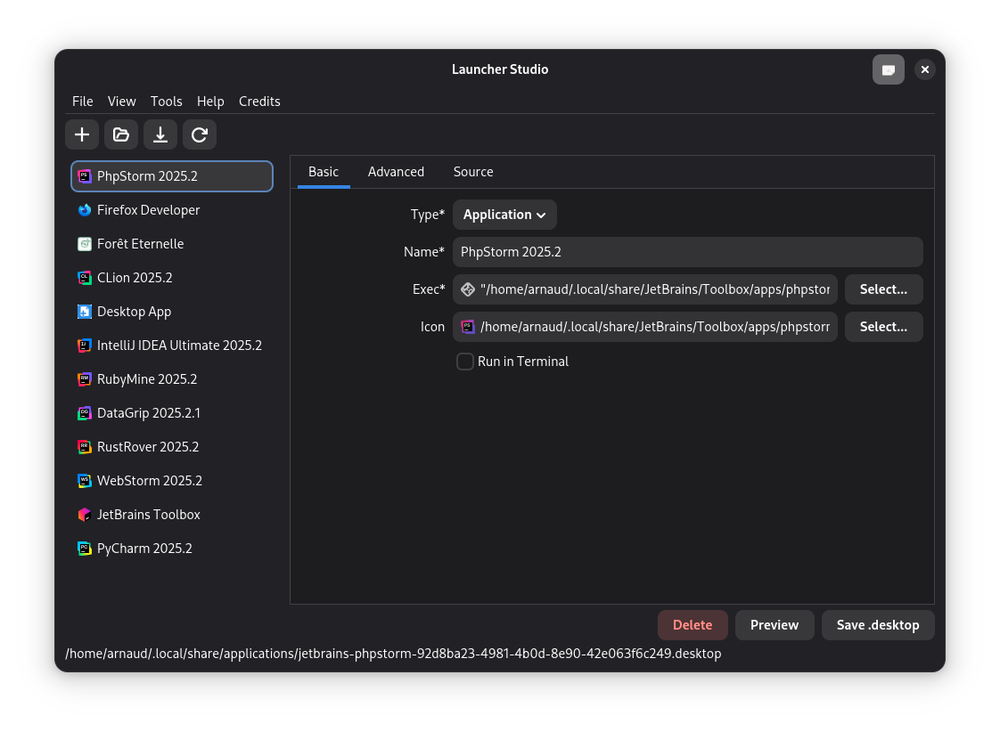

<h1 align="center">
    💫 Hi ! I'm Arnaud Michel
    
</h1>

    Welcome to my GitHub profile.
    <i>
         
        I'm a passionate developer and I love to learn new things. I'm currently working on a few projects, and I'm always open to new opportunities.
    </i>

---

## ☎️ Let's Connect!
Feel free to reach out for collaboration or just a good chat:

- 📧 Email: [contact@arnaudmichel.fr]("mailto:contact@arnaudmichel.fr")
- 🔗 Website: [arnaudmichel.fr](https://arnaudmichel.fr)
- 📱 LinkedIn: [Arnaud Michel](https://www.linkedin.com/in/arnaud-michel-1b1b3b1b3/)

## 🌱 A peek into my world

- 🥁 Music, I have a passion for music, and I play the drums. I play in a harmony and I love to compose music. 
- 📚 Learning, I love to learn new things, and I'm always looking for new opportunities to learn and grow. 
- 🏸 Sports, I love to play sports, and I'm a big fan of badminton. I play badminton regularly. 
- ⚙️ I’m currently learning Rust!
  
## 🚀 Actual Project

<table><tr><td valign="top" width="50%">

- 🔭 I’m currently working on [Launcher Studio](https://github.com/MrArnaudMichel/LauncherStudio)

- 🖥️ **Launcher Studio** is a GTK4 desktop application for creating and managing `.desktop` files on Linux. This intuitive tool lets you easily create custom launchers for your favorite applications, ensuring seamless integration with your desktop environment.

</td><td valign="top" width="50%">

  

</td></tr></table>  

### 📌 Programming Languages

### :globe_with_meridians: Web Technologies

### 🛠️ Frameworks

### :100: Tools

### 🛢️ Databases

### :computer: Operating Systems

## 📊 GitHub Stats

    

